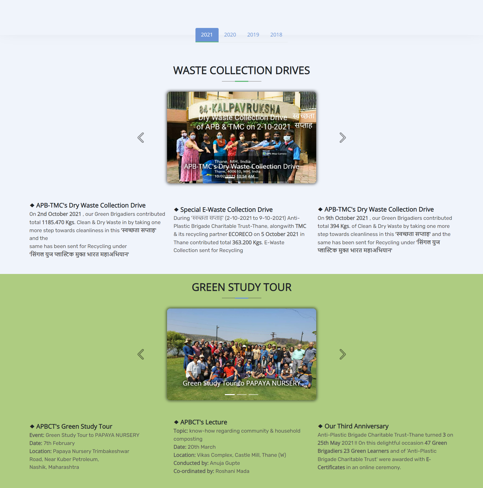
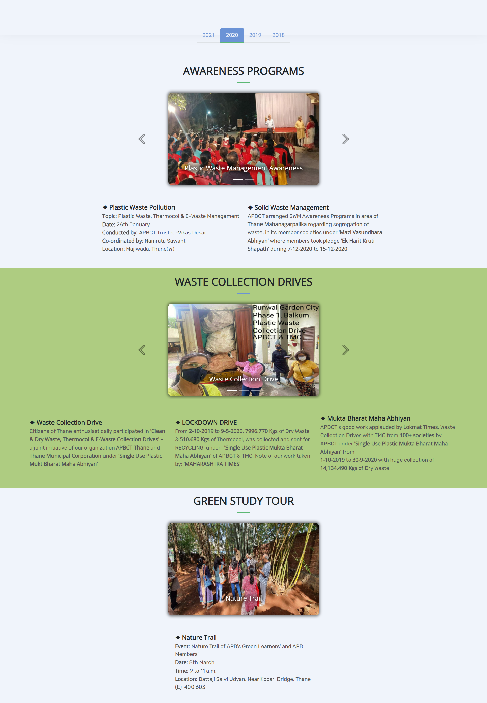
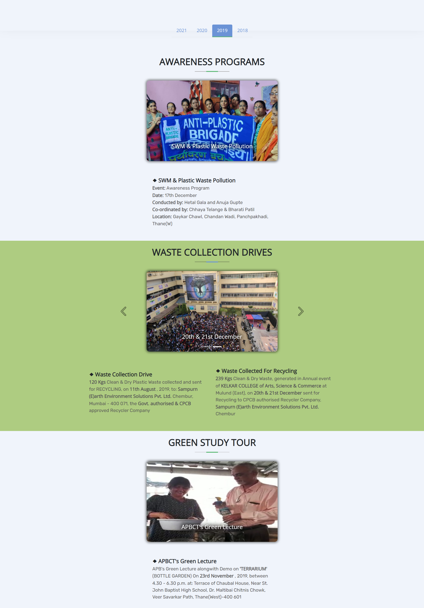
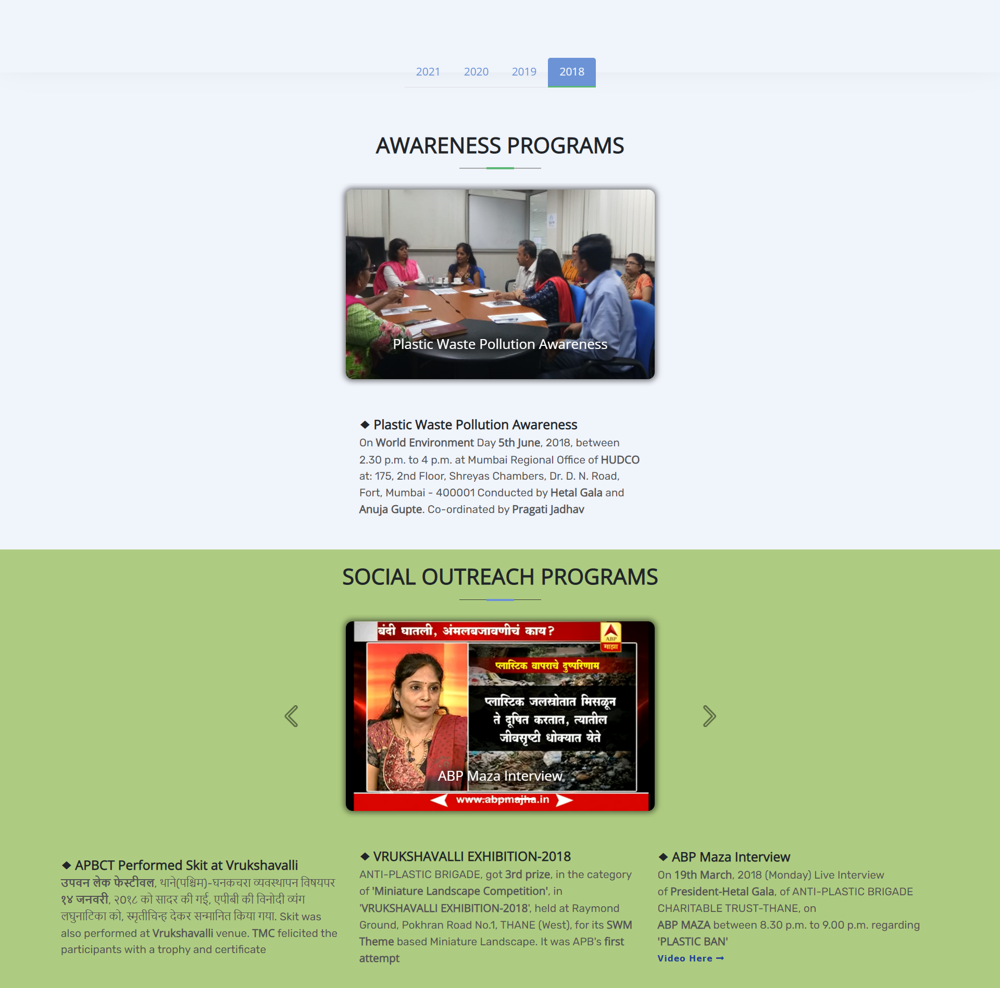

# Anti-Plastic Brigade Charitable Trust

## Built With


## Table of contents

- [Overview](#overview)
- [Screenshots](#screenshots)
- [Getting Started](#gettingstarted)
- [Contributors](#contributors)

## Overview

### Anti-Plastic Brigade Charitable Trust
Website for a Non Governmental Organisation which works on Plastic Management.
One of the major reason of “Plastic Pollution” is plastic belongs to non-biodegradable substances. It doesn't degrade and hangs out in environment for years. Issue is that not all plastics can be recycled. 
“ANTI-PLASTIC BRIGADE CHARITABLE TRUST” is a Registered NGO from Thane working mainly for Solid Waste Management along with other Green Activities since 2017.


### Screenshots
 <br> 
---
 <br>
---
 <br>
---
 <br>
---
 


## Getting Started  <a id="gettingstarted"></a>

#### Step 1:

Download or clone this repository by using the command given below:

```
git clone https://github.com/dbitsevatech/APBCT.git
```

#### Step 2:

Go to project root and open the index.html file in the browser


## Contributors <a id="contributors"></a>
  - Boris Edison<br> 
  [](https://github.com/BorisEdison)
  - Rhea Gupta<br>
  [](https://github.com/rheagupta31)
  - Siddharth Dhaigude<br>
  [](https://github.com/sd8capricon)
